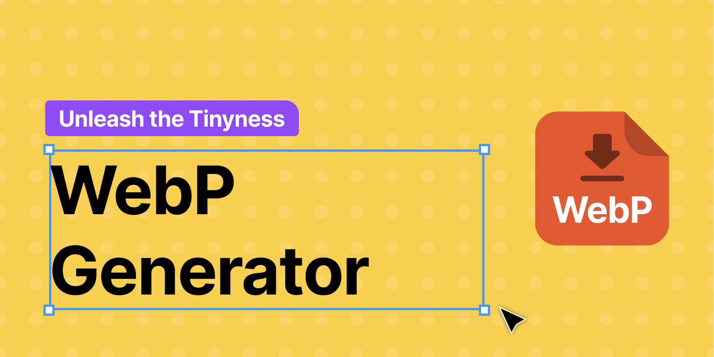

# WebP Generator Plugin for Figma

<a href='https://ko-fi.com/webpgen' target='_blank'>



**_Export WebP files from Figma for Web or Android_**

### Features

- Export any image as WebP
- Supported resolutions are xxxhdpi, xxhdpi, xhdpi, hdpi, mdpi
- Convenient folder structure to match your Android project
- The uplifting feeling of having made the project a little better

Exports the selected figma node to the hierarchical matching android ressource folders:

```
drawable-mdpi \    1x
    image.webp
drawable-hdpi \    1.5x
    image.webp
drawable-xhdpi \   2x
    image.webp
drawable-xxhdpi \  3x
    image.webp
drawable-xxxhdpi \ 4x
```

or for web:

```
image \
    image_1x.webp
    image_1_5x.webp
    image_2x.webp
    image_3x.webp
    image_4x.webp
```

Check out the plugin at [Figma](https://www.figma.com/community/plugin/1181873200384736932).
